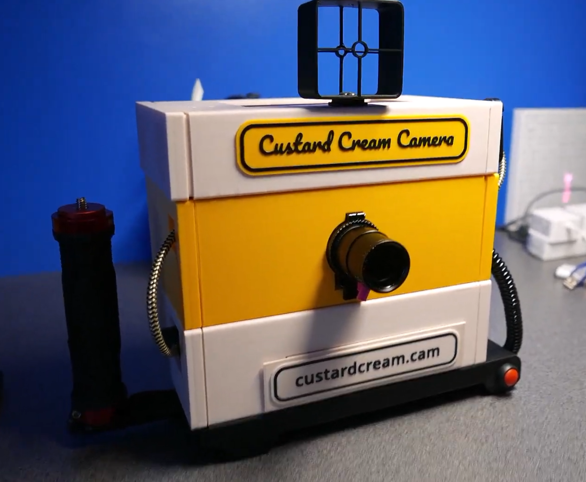

# Custard Cream Camera

A camera-and-photo-review appliance for a small touchscreen Raspberry Pi build. Takes pictures (or receives them over FTP from a real camera), lets you review, print, publish, and voice-edit them with AI - and print them on a built-in printer. It can also publish pictures to Flickr, Bluesky, and a self-hosted Custard Cream Camera Server — pick which one from a menu on the Publish button.

To find out more about the camera click on the image above to see a short video.

## Camera configuration

You can use the camera as a camera, or you can use it as an FTP server which other cameras can connect to. All the image storage, processing and printing features are available in this mode. If you are not sure what any of this means, use it in camera mode. 

`settings.json`'s top-level `"mode"` key picks the home screen:

* **`"mode": "camera"`** — a live viewfinder with **Capture**/**Play** modes: take a photo with the on-screen button, a Bluetooth/wired shutter remote, or the keyboard spacebar.
* **`"mode": "ftp"`** — no camera: this device receives JPEGs over FTP (e.g. from a Sony camera's FTP-transfer feature) and is always in Play mode, showing the newest arrival first.
* **`"mode": "camera_ftp"`** — both at once: the live viewfinder/Capture-Play flow of `"camera"` mode, plus the FTP receiver of `"ftp"` mode running in the background. A photo arriving over FTP jumps to the front and interrupts Capture/Play immediately, the same way it does in plain `"ftp"` mode.

Either way, reviewing, printing, publishing, and voice-editing photos already in `captures/` is exactly the same code and behavior — see [Home Screen: Camera Mode vs FTP Mode](docs/home-screen-modes.md).

Inspired by the camera made by [Nikbuild](https://github.com/nickbild/banamera)

## Getting Started

**New device, nothing set up yet?** Follow [Setting Up From Scratch](docs/setup-guide.md) — a
single ordered walkthrough from a bare Raspberry Pi OS install to a running camera, covering system
packages, the venv, `settings.json`, API keys, and every optional feature, in the order you'd
actually do them. Start there rather than the reference list below.

## Reference

Once a device is set up, these cover each feature in more depth than the walkthrough above —
useful when you want to change how something already-configured behaves, or when troubleshooting
something specific.

**Core:**

* [Setting Up the Python Virtual Environment](docs/venv-setup.md) — create, activate, and (if needed) recreate the `venv` this app always runs inside; what differs between camera mode and FTP mode.
* [Running the App](docs/running-the-app.md) — start it from a terminal, or launch it from a desktop icon with no keyboard needed.
* [Storing API Keys on the Device](docs/api-keys.md) — get the Gemini/Flickr/Bluesky/server keys set automatically on every launch, without committing them to git.
* [Display Backends](docs/display-backends.md) — pick between an HDMI touchscreen or a native HDMI display, and configure it in `settings.json`.
* [Home Screen: Camera Mode vs FTP Mode](docs/home-screen-modes.md) — the live viewfinder vs. reviewing FTP-received photos; reviewing/printing/speaking/publishing existing photos works the same either way.

**Camera mode:**

* [Camera Orientation](docs/camera-orientation.md) — fix an upside-down or mirrored viewfinder with `hflip`/`vflip`.
* [Exposure Compensation](docs/exposure-compensation.md) — bias the auto-exposure with on-screen EV+/EV- buttons for backlit or overexposed scenes.
* [Shutter Remotes](docs/shutter-remote.md) — trigger photos and voice edits from a Bluetooth or wired USB-serial remote instead of the touchscreen; either or both can be enabled at once.
* [Audio Output (Shutter Sound)](docs/audio-output.md) — a click sound plays when a photo is taken, configurable and safe to enable even with no audio hardware present.

**FTP mode (and `camera_ftp`):**

* [Receiving Photos over FTP](docs/ftp-setup.md) — configuring the sending camera's FTP-transfer feature to talk to this app, and how uploads get turned into previewable photos.

**Either mode:**

* [Voice-Prompted AI Edits](docs/voice-ai-edits.md) — record a spoken instruction and have Gemini edit the photo.
* [Printing](docs/printing.md) — send photos to CUPS, test the pipeline without wasting paper, and add a watermark/date stamp.
* [Publishing to Flickr](docs/publishing-flickr.md) — one-time OAuth setup, then upload photos straight from the app.
* [Publishing to Bluesky](docs/publishing-bsky.md) — post photos with an app password, no OAuth needed.

**Hardware:**

* [Canon SELPHY CP400 + CUPS](docs/printer-cups-setup.md) — get a CP400 dye-sublimation printer working with CUPS and Gutenprint on Raspberry Pi OS.

## 3D-Printed Case

STL files for the camera's enclosure are in [case/](case/) — print them and snap/screw the lids onto their matching bases:

* **Controller** — `ControllerBase.stl` with `ControllerLid.stl`, `ControllerLeftLid.stl`, and `ControllerSpeakerLid.stl` (vented for the speaker).
* **Battery** — `BatteryBase.stl` with `BatteryLidLeft.stl` and `BatteryLidRight.stl`, plus `batteryHolderLid.stl`.
* **Printer** — `PrinterBase.stl` with `PrinterLidLeft.stl` and `PrinterLidRight.stl`, housing the SELPHY CP400.
* **Handle** — `HandleBase.stl` with `HandleBaseLid.stl`.
* **Paper** — `paperLid.stl` covers the printer's paper tray.
